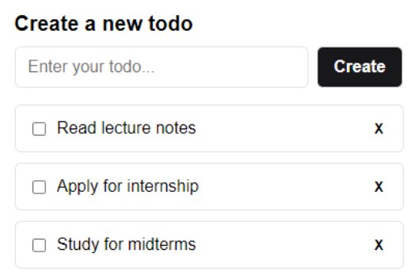

# Todo App

## About 

This branch contains working source codes of frontend and backend components for a todo web application. Angular and Spring boot frameworks are used for frontend and backend respectively.
